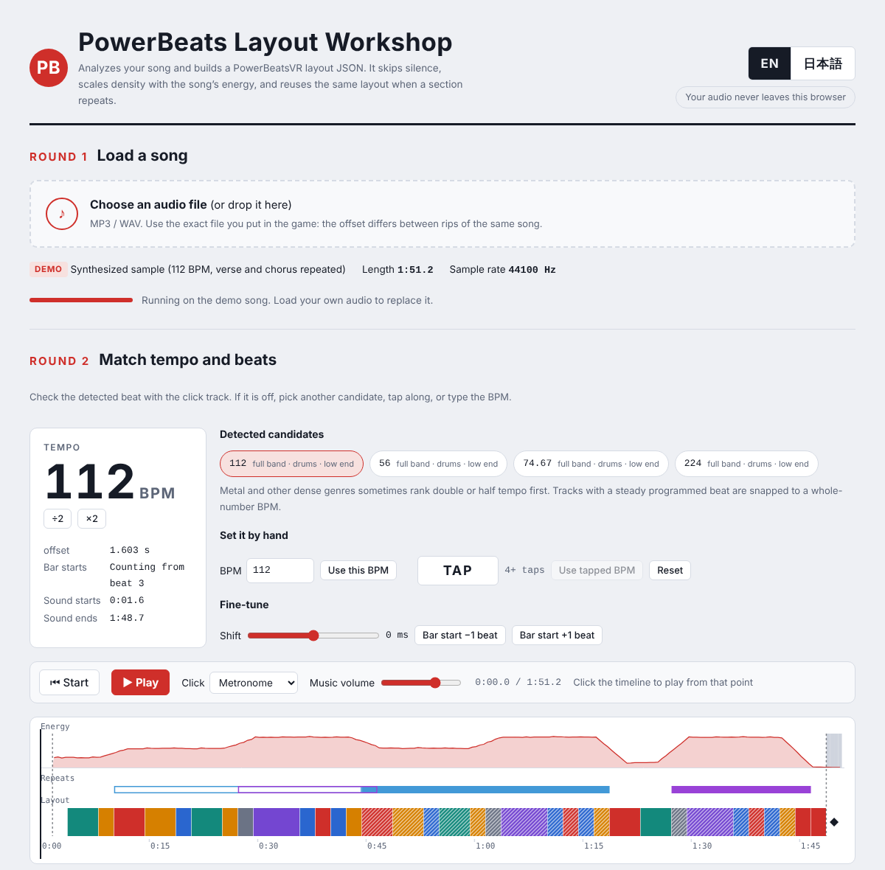

# PowerBeats 譜面工房（PowerBeats Layout Workshop）

[English](README.md) | **日本語**

手持ちの MP3 / WAV から、**PowerBeatsVR**（PC・Quest）用のカスタム譜面（レイアウトJSON）を作るブラウザツールです。

ゲーム内の自動生成はBPMしか見ていません。このツールは曲全体を解析し、次のように配置します。

- イントロ・アウトロの無音にはノーツを置かない
- 盛り上がる所ほどノーツを増やす
- 1番と2番のように繰り返す区間には同じ配置を使う

ランダムではなく本物のボクシングのコンビネーションで組み立てる**ボクササイズモード**もあります。

処理はすべてブラウザの中で行います。音源がどこかへ送られることはなく、インストールも不要です。

## 使い方

1. `index.html` をパソコンのブラウザ（Chrome / Edge / Firefox）で開きます。ダウンロードしたファイルをダブルクリックするか、GitHub Pages が用意されていればそのリンクを開いてください。
2. **Round 1**：ゲームで使う音源ファイルを読み込みます。
3. **Round 2**：テンポを確認します。メトロノームのクリックをオンにして**再生**し、ずれていたら別のBPM候補を選ぶか、**TAP** や手入力で直します。
4. **Round 3**：難易度とモードを選び、スライダーを調整します。変更はタイムラインにすぐ反映されます。
5. **Round 4**：**JSONを保存**を押します。
6. JSON をゲームの `Layouts` フォルダに、**音源と同じ名前（拡張子だけ違う）**で置きます。

| 環境 | Layouts フォルダ |
|---|---|
| PC（Steam） | `steamapps/common/PowerBeatsVR/PowerBeatsVR_Data/Layouts` |
| Quest（SideQuest などで） | `Android/data/com.FiveMindCreationsUGhaftungsbeschrnkt.PowerBeatsVR/files/Layouts` |

例：`My Song.mp3` と `My Song.json`

> 同じ曲でも音源ファイルによって鳴り始めの位置がわずかに違います。譜面の `offset` は読み込んだファイルを基準に測るので、ゲームに入れる音源そのものを使ってください。

## 機能

### 曲の解析
- **テンポ検出**：倍・半分を含む複数の候補を出します。タップや手入力でも合わせられます。打ち込みの曲は整数BPMに丸めます。
- **拍合わせ**：offset と小節頭を合わせます。クリック音で確認でき、±250ms の微調整もできます。
- **無音判定**：無音のイントロ・アウトロ・ブレイクにはノーツを置きません。しきい値は調整できます。
- **ノーツなし区間**：タイムラインをドラッグして、好きな範囲を空けられます。
- **盛り上がり**：静かな所は間隔を広く、盛り上がる所は密にします。
- **繰り返し検出**：和音と音色が似た区間には、先に出た区間の配置をコピーします。左右反転も選べます。
- **最後まで再生**：ゲームは最後の拍が過ぎると曲を終えます。そこで曲の終わり約1秒前に空の拍を置き、無音判定やノーツなし区間のアウトロでも途中で終わらないようにしています。

### 標準モード
公式の自動生成と同じパターンと形を使います。パンチ・ストリーム・スイング・スクワット・ダッジ・アーチに加え、パワーボール率・両手同時・スパイクを調整できます。

- 各要素は 0〜10 で頻度を変えられ、**0 にすると一切出ません**。たとえば、ダッキングやウィービングなしでパンチだけの譜面も作れます。
- 初期値は公式と同じで、すべて5、ビギナーはストリームとパンチのみです。
- ストリームを静かな区間に寄せて、サビをパンチ中心にできます。

### ボクササイズモード
ボクシングのコンビネーションで配置します（1 ジャブ、2 ストレート、3 前の手のフック、4 後ろの手のフック、5 前の手のアッパー、6 後ろの手のアッパー）。

- **コンビネーション**：`1-2`、`1-2-3-2`、`6-3-2`、`1-2-スリップ-2`、`ダック-6-3` など約40種類。難易度が上がるほど長いものが解禁されます。
- **手の順番**：手は自然に交互に出ます。スリップの後は必ず逆の手で返します。
- **小休止**：コンビネーションの後に小休止を入れ、次は強拍から始めます。同じコンビネーションを2回続けて反復練習させることもあります。
- **配置**：フックは横、アッパーは下から上へのスイングです。ボディはみぞおちの高さ、スリップは横の壁、ダッキングは頭上の壁で表します。
- **構え**：オーソドックス、サウスポー、16小節ごとの入れ替えから選べます。
- **量の調整**：打つ間隔（自動／1拍ごと／2拍ごと）、コンビネーション後の休み、コンビネーションの長さを設定できます。
- **使用回数**：どのコンビネーションを何回使ったかを結果欄に表示します。

### その他
- 設定は難易度ごとに記憶します。シードを固定すれば毎回同じ結果になります。
- **既存JSONへの追加**：BPMと offset が一致すれば、手持ちの譜面のほかの難易度を残したまま追加できます。
- 画面は英語と日本語に対応しています。言語は自動で選ばれ、右上で切り替えられます。

## ヒント

- **メタルなどでテンポを間違える**：ツーバスが速い曲では、倍や半分のテンポが上位に来ることがあります。×2 / ÷2 や TAP を試し、メトロノームで確認してください。
- **ノーツが早い・遅い**：Round 2 の「ずらす」で調整します。クリックが2拍目に来るなら「小節頭 ±1拍」を使ってください。
- **ノーツが多すぎる・少なすぎる**：標準モードは詳細設定の「密度」、ボクササイズモードは「ノーツの量」の3項目で調整します。
- **繰り返しのコピーが多すぎる・少なすぎる**：詳細設定の「繰り返し判定の厳しさ」を変えてください。

## 制限

- BPMは1曲に1つだけです（譜面形式の制限）。途中でテンポが変わる曲はずれていきます。
- リズムが自由な曲や、ドラムがとても小さい曲は検出に失敗することがあります。その場合はBPMを手入力してください。
- ボクササイズのスイングの向きは公式譜面を元にしていて、確認したのはまだ少人数です。感想を歓迎します。
- 1拍単位でのみ配置します。半拍のノーツは作りません。

## 仕組み

1. Web Audio API で音源をデコードし、22kHz モノラルに変換します。
2. 短時間フーリエ変換で、次の値を求めます。
   - オンセット（全帯域・低域・ドラム）
   - 音量
   - クロマ（音の高さの成分）
   - 大まかな音色
3. オンセットの自己相関からテンポ候補を出し、曲全体のくし形フィルタで精度と拍の位置を詰めます。小節頭は低音のアタックと和音の変化から推定します。
4. 拍ごとの音量とアタックの強さから盛り上がりを求めます。小節どうしの類似度行列で繰り返し区間を探します。
5. 小節ごとに先頭から配置していきます。似た区間が前にあればその配置をコピーし、なければスライダーの重みと盛り上がりに応じてパターン（ボクササイズではコンビネーション）を選びます。

ライブラリは使っておらず、HTMLファイル1つで動きます。

譜面ファイルの形式は [docs/FORMAT.md](docs/FORMAT.md)（英語）にまとめています。

## 免責

非公式のファンメイドツールです。PowerBeatsVR の開発元 Five Mind Creations とは関係ありません。ファイルを置き換える前に `Layouts` フォルダをバックアップしてください。

## ライセンス

[LICENSE](LICENSE) を参照してください。
